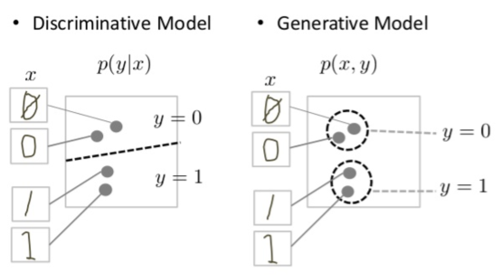
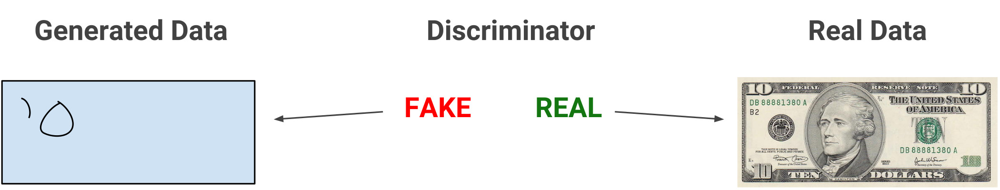
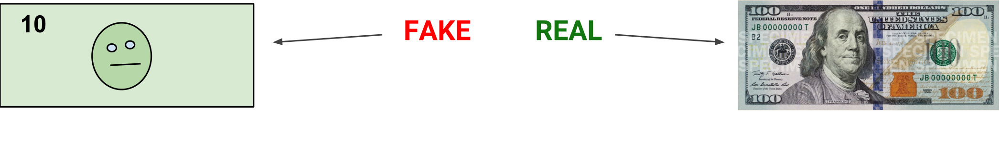
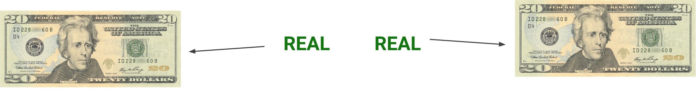
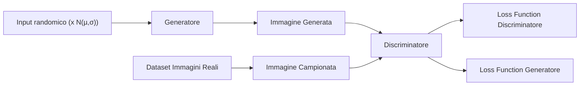

# GAN-StudyOfArchitectures

Progetto per il corso "Machine Learning and Data Mining" per la laurea magistrale in Ingegneria Informatica all'Università degli Studi di Brescia.

## Indice

 - [Introduzione](#introduzione)
   - [Cos'è un modello generativo?](#modelli-generativi)
   - [I modelli generativi sono difficili](#i-modelli-generativi-sono-difficili)
 - [Anatomia di una GAN](#anatomia-di-una-gan)
   - [Panoramica della struttura GAN](#panoramica-della-struttura-gan)
   - [Discriminatore](#discriminatore)
   - [Generatore](#generatore)
   - [Allenamento di una GAN](#allenamento-di-una-gan)
   - [Funzione di Loss](#funzione-di-loss)
 - [Architetture](#architetture)
   - [BEGAN](#began)
   - [DCGAN](#dcgan)
   - [EBGAN](#ebgan)
   - [GAN](#gan)
   - [WGAN](#wgan)
 - [Risultati](#risultati)
   - [MNIST](#mnist)
   - [CelebA](#celeba)

## Introduzione

Il progetto in questione aveva l'obiettivo di mettere a confronto diverse architetture di reti GAN per valutare le loro performance su due diversi dataset (**MNIST** e **CelebA**). Le architetture che abbiamo testato sono:

 - **BEGAN** (_Boundary Equilibrium Generative Adversarial Networks_)
 - **DCGAN** (_Deep Convolutional Generative Adversarial Network_)
 - **EBGAN** (_Energy-based Generative Adversarial Network_)
 - **GAN** (_Generative Adversarial Networks_)
 - **WGAN** (_Wasserstein Generative Adversarial Networks_)

Nei capitoli di questo documento andremo a descrivere ciò che si intende per rete generativa e come differiscono le GAN da questa definizione iniziale, specificandosi poi nelle diverse architetture (ognuna con le proprie differenze rispetto alla rete GAN base).

### Modelli Generativi

Cosa si intende per "generativo" nel nome "Rete Generativa Avversaria"? "Generativo" descrive una classe di modelli statistici in contrasto con i modelli discriminativi.

In modo informale:

- I modelli **generativi** possono generare nuove istanze di dati.
- I modelli **discriminatori** fanno distinzione tra i diversi tipi di istanze di dati.

Un modello generativo potrebbe generare nuove foto di animali che assomigliano ad animali reali, mentre un modello discriminatorio potrebbe distinguere un cane da un gatto. I GAN sono solo un tipo di modello generativo.

In modo più formale, dato un insieme di istanze di dati X e un gruppo di etichette Y:

- I modelli **generativi** acquisiscono la probabilità congiunta p(X, Y) o solo p(X) se non ci sono etichette.
- I modelli **discriminatori** acquisiscono la probabilità condizionale p(Y | X).

Un modello generativo include la distribuzione dei dati stessi e ti mostra quanto è probabile un dato esempio. Ad esempio, i modelli che prevedono la parola successiva in una sequenza sono in genere generativi (di solito molto più semplici dei GAN) perché possono assegnare una probabilità a una sequenza di parole.

Un modello discriminatorio ignora la domanda se una determinata istanza è probabile e ti dice semplicemente con quale probabilità un'etichetta si applica all'istanza.

### I modelli generativi sono difficili

I modelli generativi affrontano un'attività più difficile rispetto ai modelli discriminatori analoghi. I modelli generativi devono modellare di più.
Un modello generativo per le immagini potrebbe catturare correlazioni come "gli oggetti che appaiono come barche probabilmente appariranno vicino a cose che sembrano acqua" e "è improbabile che gli occhi appaiano sulla fronte". Si tratta di distribuzioni molto complicate.
Al contrario, un modello discriminatorio potrebbe scoprire la differenza tra "barca a vela" o "non barca a vela" cercando semplicemente alcuni schemi che ricorrono in queste immagini. Potrebbe ignorare molte delle correlazioni che il modello generativo deve invece considerare per generare immagini valide.
I modelli discriminatori tentano di tracciare i confini nello spazio dei dati, mentre i modelli generativi cercano di modellare il modo in cui i dati vengono posizionati all'interno dello spazio. Ad esempio, il seguente diagramma mostra modelli discriminatori e generativi di cifre scritte a mano:

|  |
|:------------------------------------------------------------------------------------------:|
|         **Figura 1: modelli discriminatori e generativi di cifre scritte a mano**          |

Il modello discriminatorio cerca di distinguere gli zero e gli uno disegnando una linea nello spazio dati. Se trova la linea corretta, può distinguere gli 0 da 1 senza dover modellare esattamente dove si trovano le istanze nello spazio dei dati su entrambi i lati della linea.
Al contrario, il modello generativo cerca di produrre uni e zeri generando cifre che cadano vicino alle loro controparti reali nello spazio dati. Deve modellare la distribuzione nell'intero spazio dati.
Le GAN offrono un modo efficace per addestrare modelli così completi per assomigliare a una distribuzione reale. Per comprendere come funzionano, dovremo comprendere la struttura di base di un GAN.

## Anatomia di una GAN

### Panoramica della struttura GAN

Una rete generativa avversaria (GAN) si compone di due parti:
- Il **generatore** impara a generare dati plausibili. Le istanze generate diventano esempi di addestramento negativi per il discriminatore.
- Il **discriminatore** impara a distinguere i dati falsi generati dal generatore da dati reali provenienti dal dataset. Il discriminatore penalizza il generatore quando produce dei risultati non plausibili.

Quando l'allenamento è all'inizio, il generatore produce dati ovviamente falsi e quindi il discriminatore impara velocemente a dire che quei dati sono falsi:

Man mano che l'addestramento procede, il generatore si avvicina alla produzione di output che possono ingannare il discriminatore:

Infine, se l'addestramento del generatore si conclude per il meglio, il discriminatore peggiora nella comprensione della differenza tra reale e falso. Inizia a classificare i dati falsi come reali e la sua accuratezza diminuisce.

Qui riportiamo un diagramma dell'intero sistema

$\equiv$

Sia il generatore che il discriminatore sono reti neurali. L'output del generatore è collegato direttamente all'ingresso del discriminatore. Attraverso la backpropagation, la classificazione del discriminatore fornisce un indicatore che il generatore utilizza per aggiornare i suoi pesi.

### Discriminatore

### Generatore

### Allenamento di una GAN

### Funzione di Loss

## Architetture

### BEGAN

_BEGAN: Boundary Equilibrium Generative Adversarial Networks_

#### Autori

David Berthelot, Thomas Schumm, Luke Metz

#### Descrizione

### DCGAN

_Deep Convolutional Generative Adversarial Network_

#### Autori

Alec Radford, Luke Metz, Soumith Chintala

#### Descrizione

### EBGAN

_Energy-based Generative Adversarial Network_

#### Autori

Junbo Zhao, Michael Mathieu, Yann LeCun

#### Descrizione

### GAN

_Generative Adversarial Network_

#### Autori

Ian J. Goodfellow, Jean Pouget-Abadie, Mehdi Mirza, Bing Xu, David Warde-Farley, Sherjil Ozair, Aaron Courville, Yoshua Bengio

#### Descrizione

### WGAN

_Wasserstein Generative Adversarial Network_

#### Autori

Martin Arjovsky, Soumith Chintala, Léon Bottou

#### Descrizione

## Risultati

Di seguito si mostrano i risultati dei vari modelli allenati sui dataset MNIST e CelebA

### MNIST
|   |   |   |   |   |
|:--------------------------------------------------------------------------------------------:|:--------------------------------------------------------------------------------------------:|:--------------------------------------------------------------------------------------------:|:--------------------------------------------------------------------------------------------:|:--------------------------------------------------------------------------------------------:|
|                                          ***GAN***                                           |                                          ***WGAN***                                          |                                         ***BEGAN***                                          |                                         ***DCGAN***                                          |                                         ***EBGAN***                                          |

### CelebA
|   |   |   |   |   |
|:--------------------------------------------------------------------------------------------:|:--------------------------------------------------------------------------------------------:|:--------------------------------------------------------------------------------------------:|:--------------------------------------------------------------------------------------------:|:--------------------------------------------------------------------------------------------:|
|                                          ***GAN***                                           |                                          ***WGAN***                                          |                                         ***BEGAN***                                          |                                         ***DCGAN***                                          |                                         ***EBGAN***                                          |

&copy; Glisenti Mirko, Tummolo Massimiliano - 2022