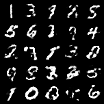
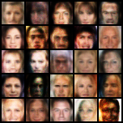

# GAN-StudyOfArchitectures

Progetto per il corso "Machine Learning and Data Mining" per la laurea magistrale in Ingegneria Informatica all'Università degli Studi di Brescia.

## Indice

<!-- TOC -->
* [Introduzione](#introduzione)
  * [Modelli Generativi](#modelli-generativi)
  * [I modelli generativi sono difficili](#i-modelli-generativi-sono-difficili)
* [Anatomia di una GAN](#anatomia-di-una-gan)
  * [Panoramica della struttura GAN](#panoramica-della-struttura-gan)
  * [Discriminatore](#discriminatore)
    * [Dati di addestramento per discriminatori](#dati-di-addestramento-per-discriminatori)
    * [Allenare il discriminatore](#allenare-il-discriminatore)
  * [Generatore](#generatore)
    * [Input randomico](#input-randomico)
    * [Usare il discriminatore per allenare il generatore](#usare-il-discriminatore-per-allenare-il-generatore)
  * [Allenamento di una GAN](#allenamento-di-una-gan)
    * [Addestramento alternato](#addestramento-alternato)
    * [Convergenza](#convergenza)
  * [Funzioni di Loss](#funzioni-di-loss)
    * [Una o due funzioni di loss?](#una-o-due-funzioni-di-loss)
    * [Minimax Loss](#minimax-loss)
    * [Minimax Loss modificata](#minimax-loss-modificata)
    * [Vulnerabilità della loss function base](#vulnerabilit-della-loss-function-base)
    * [Ulteriori considerazioni](#ulteriori-considerazioni)
* [GAN nel mondo reale](#gan-nel-mondo-reale)
  * [Problemi comuni](#problemi-comuni)
    * [Vanishing Gradients](#vanishing-gradients)
    * [Mode Collapse](#mode-collapse)
    * [Mancata convergenza](#mancata-convergenza)
* [Variazioni alle GAN](#variazioni-alle-gan)
  * [Progressive GAN](#progressive-gan)
  * [Conditional GAN](#conditional-gan)
  * [Image-to-Image Translation](#image-to-image-translation)
  * [CycleGAN](#cyclegan)
  * [Text-to-Image Synthesis](#text-to-image-synthesis)
  * [Super-resolution](#super-resolution)
  * [Face Inpainting](#face-inpainting)
  * [Text-to-Speech](#text-to-speech)
* [Architetture prese in esame](#architetture-prese-in-esame)
  * [GAN](#gan)
  * [WGAN](#wgan)
  * [BEGAN](#began)
  * [DCGAN](#dcgan)
  * [EBGAN](#ebgan)
* [Risultati](#risultati)
  * [MNIST](#mnist)
  * [CelebA](#celeba)
<!-- TOC -->

## Introduzione

Il progetto in questione aveva l'obiettivo di mettere a confronto diverse architetture di reti GAN per valutare le loro performance su due diversi dataset (**MNIST** e **CelebA**). Le architetture che abbiamo testato sono:

 - **BEGAN** (_Boundary Equilibrium Generative Adversarial Networks_)
 - **DCGAN** (_Deep Convolutional Generative Adversarial Network_)
 - **EBGAN** (_Energy-based Generative Adversarial Network_)
 - **GAN** (_Generative Adversarial Networks_)
 - **WGAN** (_Wasserstein Generative Adversarial Networks_)

Nei capitoli di questo documento andremo a descrivere ciò che si intende per rete generativa e come differiscono le GAN da questa definizione iniziale, specificandosi poi nelle diverse architetture (ognuna con le proprie differenze rispetto alla rete GAN base).

### Modelli Generativi

Cosa si intende per "generativo" nel nome "Rete Generativa Avversaria"? "Generativo" descrive una classe di modelli statistici in contrasto con i modelli discriminativi.

In modo informale:

- I modelli **generativi** possono generare nuove istanze di dati.
- I modelli **discriminatori** fanno distinzione tra i diversi tipi di istanze di dati.

Un modello generativo potrebbe generare nuove foto di animali che assomigliano ad animali reali, mentre un modello discriminatorio potrebbe distinguere un cane da un gatto. I GAN sono solo un tipo di modello generativo.

In modo più formale, dato un insieme di istanze di dati X e un gruppo di etichette Y:

- I modelli **generativi** acquisiscono la probabilità congiunta p(X, Y) o solo p(X) se non ci sono etichette.
- I modelli **discriminatori** acquisiscono la probabilità condizionale p(Y | X).

Un modello generativo include la distribuzione dei dati stessi e ti mostra quanto è probabile un dato esempio. Ad esempio, i modelli che prevedono la parola successiva in una sequenza sono in genere generativi (di solito molto più semplici dei GAN) perché possono assegnare una probabilità a una sequenza di parole.

Un modello discriminatorio ignora la domanda se una determinata istanza è probabile e ti dice semplicemente con quale probabilità un'etichetta si applica all'istanza.

### I modelli generativi sono difficili

I modelli generativi affrontano un'attività più difficile rispetto ai modelli discriminatori analoghi. I modelli generativi devono modellare di più.
Un modello generativo per le immagini potrebbe catturare correlazioni come "gli oggetti che appaiono come barche probabilmente appariranno vicino a cose che sembrano acqua" e "è improbabile che gli occhi appaiano sulla fronte". Si tratta di distribuzioni molto complicate.
Al contrario, un modello discriminatorio potrebbe scoprire la differenza tra "barca a vela" o "non barca a vela" cercando semplicemente alcuni schemi che ricorrono in queste immagini. Potrebbe ignorare molte delle correlazioni che il modello generativo deve invece considerare per generare immagini valide.
I modelli discriminatori tentano di tracciare i confini nello spazio dei dati, mentre i modelli generativi cercano di modellare il modo in cui i dati vengono posizionati all'interno dello spazio. Ad esempio, il seguente diagramma mostra modelli discriminatori e generativi di cifre scritte a mano:

|  |
|:------------------------------------------------------------------------------------------:|
|         **Figura 1: modelli discriminatori e generativi di cifre scritte a mano**          |

Il modello discriminatorio cerca di distinguere gli zero e gli uno disegnando una linea nello spazio dati. Se trova la linea corretta, può distinguere gli 0 da 1 senza dover modellare esattamente dove si trovano le istanze nello spazio dei dati su entrambi i lati della linea.
Al contrario, il modello generativo cerca di produrre uni e zeri generando cifre che cadano vicino alle loro controparti reali nello spazio dati. Deve modellare la distribuzione nell'intero spazio dati.
Le GAN offrono un modo efficace per addestrare modelli così completi per assomigliare a una distribuzione reale. Per comprendere come funzionano, dovremo comprendere la struttura di base di un GAN.

## Anatomia di una GAN

### Panoramica della struttura GAN

Una rete generativa avversaria (GAN) si compone di due parti:
- Il **generatore** impara a generare dati plausibili. Le istanze generate diventano esempi di addestramento negativi per il discriminatore.
- Il **discriminatore** impara a distinguere i dati falsi generati dal generatore da dati reali provenienti dal dataset. Il discriminatore penalizza il generatore quando produce dei risultati non plausibili.

Quando l'allenamento è all'inizio, il generatore produce dati ovviamente falsi e quindi il discriminatore impara velocemente a dire che quei dati sono falsi:

Man mano che l'addestramento procede, il generatore si avvicina alla produzione di output che possono ingannare il discriminatore:

Infine, se l'addestramento del generatore si conclude per il meglio, il discriminatore peggiora nella comprensione della differenza tra reale e falso. Inizia a classificare i dati falsi come reali e la sua accuratezza diminuisce.

Qui riportiamo un diagramma dell'intero sistema


Sia il generatore che il discriminatore sono reti neurali. L'output del generatore è collegato direttamente all'ingresso del discriminatore. Attraverso la backpropagation, la classificazione del discriminatore fornisce un indicatore che il generatore utilizza per aggiornare i suoi pesi.

### Discriminatore

Il discriminatore in una GAN è semplicemente un classificatore. Cerca di distinguere i dati reali dai dati creati dal generatore. Potrebbe utilizzare qualsiasi architettura di rete appropriata per il tipo di dati che sta classificando.


<p align="center">Figura 2: backpropagation nell'addestramento del discriminatore</p>

#### Dati di addestramento per discriminatori

I dati di addestramento per i discriminatori provengono da due fonti:
- Istanze di **dati reali**, come foto di persone. Il discriminatore usa queste istanze come istanze positive durante il suo allenamento
- Istanze di **dati fake** creati dal generatore. Il discriminatore usa queste istanze come istanze negative durante il suo allenamento

Nella Figura 2, le due caselle "Immagine Generata" e "Immagine Reale" rappresentano queste due origini dati che alimentano il discriminatore.
Durante l'addestramento dei discriminatori, il generatore non viene addestrato.
I suoi pesi rimangono costanti mentre produce esempi su cui il discriminatore può allenarsi.

#### Allenare il discriminatore

Il discriminatore si connette a due loss function.
Durante l'addestramento del discriminatore, esso ignora la loss del generatore e utilizza semplicemente la loss del discriminatore.
Utilizziamo la loss del generatore durante la formazione dello stesso.

Durante l'allenamento del discriminatore:
- il discriminatore classifica sia dati reali che dati fake del generatore
- la funzione di loss del discriminatore lo penalizza se classifica istanze fake come reali o viceversa
- il discriminatore aggiorna i suoi pesi mediante la backpropagation

### Generatore

Il generatore di una GAN impara come creare dei buoni dati fake incorporando il feedback dato dal discriminatore.
Impara come far classificare i suoi output come input reali dal discriminatore.
L'allenamento del generatore richiede una maggior integrazione tra discriminatore e generatore rispetto a quanta ne richiede l'allenamento del discriminatore.
La porzione delle GAN che serve per allenare un generatore è formata da:
- un input randomico
- la rete del generatore, che trasforma un input randomico in un'istanza di dati
- la rete del discriminatore, che classifica i dati generati
- l'output del discriminatore
- la loss function del generatore, che penalizza il generatore se fallisce ad "ingannare" il discriminatore


<p align="center">Figura 3: backpropagation nell'addestramento del generatore</p>

#### Input randomico

Le reti neurali richiedono una forma di input.
Normalmente, inseriamo i dati con cui vogliamo fare qualcosa, ad esempio un'istanza che vogliamo classificare o su cui vogliamo fare una previsione.
Ma cosa utilizziamo per l'input di una rete che genera istanze di dati completamente nuove?
Nella loro forma base, le GAN prendono in input un random noise (rumore).
Il generatore quindi trasforma questo rumore in un output con del significato.
Introducendo del rumore, possiamo far produrre alle GAN una enorme varietà di dati, in base a dove prelevo il rumore all'interno della distribuzione target.
Gli esperimenti suggeriscono che la distribuzione del rumore non è molto importante, quindi possiamo scegliere qualcosa da cui è facile campionare, come una distribuzione uniforme.
Per comodità, lo spazio da cui viene campionato il rumore è solitamente di dimensioni inferiori rispetto alla dimensione dello spazio di output.
Nel nostro caso abbiamo usato una distribuzione normale su 0 e 1 { N(z | µ = 0,σ = 1) }.

#### Usare il discriminatore per allenare il generatore

Per addestrare una rete neurale, modifichiamo i pesi della rete per ridurre l'errore o la loss dei suoi output.
Tuttavia, nelle GAN il generatore non è direttamente collegato con la loss function che ci interessa e che ci serve per capire 
Il generatore si collega direttamente alla rete del discriminatore, ed esso produce l'output che stiamo cercando di influenzare.
La funzione di loss del generatore lo penalizza se produce un output che il discriminatore classifica come falso.

Questo pezzo extra di rete neurale deve essere incluso nella backpropagation.
La backpropagation aggiusta ogni peso nel modo corretto calcolando l'impatto del peso stesso sull'output (come cambia l'output se cambio il peso?).
Ma l'impatto di un peso della rete del generatore dipende dall'impatto dei pesi della rete del discriminatore con i quali è collegato il peso iniziale.
Quindi la backpropagation inizia dall'output e torna indietro attraverso il discriminatore e poi arriva nel generatore.

Allo stesso tempo, non vogliamo che il discriminatore venga aggiornato durante l'allenamento del generatore.
Trying to hit a moving target would make a hard problem even harder for the generator.
Questo perché cercare di "colpire" un obiettivo che si sta muovendo (l'aggiornamento del discriminatore
potrebbe far variare le sue classificazioni nel mentre che si sta allenando il generatore) renderebbe il compito di
allenare il generatore ancora più difficile.

Il training del generatore procede in questo modo:
- si campiona del rumore casuale
- viene prodotto l'output del generatore dal rumore casuale
- si ottiene la classificazione "vero" o "falso" dal discriminatore
- si calcola la loss function dalla classificazione del discriminatore
- viene eseguita la backpropagation attraverso il discriminatore e poi il generatore per ottenere i gradienti
- vengono usati i gradienti per aggiornare i pesi del solo generatore

Questa è una iterazione dell'allenamento del generatore.

### Allenamento di una GAN

Dato che una GAN contiene due reti addestrate separatamente, il suo algoritmo di training incontra due complicazioni:
- la GAN deve destreggiarsi tra due tipi differenti di allenamento (generatore e discriminatore)
- la convergenza di una GAN è difficile da identificare

#### Addestramento alternato

Il generatore e il discriminatore hanno differenti processi di addestramento. Quindi, come alleniamo le GAN nel loro complesso?

L'allenamento delle GAN procede a intervalli alternati:
1. Il discriminatore viene allenato per una o più epoche
2. Il generatore viene allenato per una o più epoche
3. Si ripetono gli step 1 e 2 per continuare ad addestrare le due reti

Manteniamo il generatore costante durante l'allenamento del discriminatore.
Mentre il discriminatore si allena per capire come distinguere i dati reali dai falsi, deve anche imparare come riconoscere i difetti del generatore.
Questo è un problema diverso per un generatore accuratamente addestrato rispetto a un generatore non addestrato che produce un output casuale.

Similmente, manteniamo il discriminatore costante durante la fase di training del generatore.
Altrimenti il generatore proverebbe a colpire un bersaglio continuamente in movimento e potrebbe non convergere mai.

È questo continuo "avanti e indietro" che permette alle GAN di affrontare problemi generativi altrimenti intrattabili. 
Possiamo avere un "appiglio" per risolvere problemi generativi difficili se partiamo con un problema di classificazione più semplice.
Al contrario, se non si può allenare un classificare per dirci la differenza tra dati reali e dati generati anche per l'output iniziale del generatore casuale, non è possibile iniziare l'addestramento GAN.

#### Convergenza

Mentre il generatore migliora con l'allenamento, le performance del discriminatore peggiorano perché non riesce più a trovare le differenze tra reale e fake.
Se il generatore ottiene dei risultati ottimali, il discriminatore avrà un accuratezza del 50%.
In effetti, il discriminatore lancia una moneta per fare la sua predizione.

Questa progressione rappresenta un problema per la convergenza delle GAN nel loro complesso: il feedback del discriminatore diventano sempre meno significativi nel tempo.
Se la GAN continua l'addestramento e supera il punto in cui il discriminatore sta dando un feedback completamente casuale, allora il generatore continuerà ad allenarsi su feedback insensati e la sua stessa qualità e accuratezza potrebbe collassare.

Per le GAN, la convergenza è spesso uno stato breve e temporaneo piuttosto che uno stato stabile.

### Funzioni di Loss

Le GAN tentano di replicare una distribuzione di probabilità.
Quindi, devono utilizzare funzioni di loss che riflettono la distanza tra la distribuzione dei dati generati dalla GAN e la distribuzione dei dati reali.

Come si cattura la differenza tra due distribuzione nelle funzioni di loss delle GAN?
Questa è una domanda oggetto di una specifica area di ricerca tuttora attiva, e molti approcci sono stati proposti.
La GAN base utilizza una funzione di loss chiamata **minimax**.

#### Una o due funzioni di loss?

Una GAN può avere due funzioni di loss: una per l'allenamento del generatore e una per l'allenamento del discriminatore.
Come possono due funzioni di loss lavorare assieme per rappresentare una misura di distanza tra distribuzioni di probabilità?

Nello schema che vedremo qui sotto, le loss del generatore e del discriminatore derivano da una singola misura di distanza tra distribuzioni di probabilità.
In ogni caso, il generatore può andare a influenzare un solo termine nella misura di distanza: il termine che rappresenta la distribuzione dei dati fake.
Quindi durante l'allenamento del generatore andiamo a eliminare l'altro termine, che rappresenta la distribuzione dei dati reali.

Le loss del generatore e del discriminatore sono diverse alla fine, nonostante derivino da una singola formula.

#### Minimax Loss

Nel paper che ha introdotto le GAN, il generatore prova a minimizzare la funzione seguente mentre il discriminatore prova a massimizzarla:

<p align="center">$E_{x}[log(D(x))] + E_{z}[log(1 - D(G(z)))]$</p>

In questa funzione:
- $D(x)$ è la stima della probabilità che l'istanza reale x sia reale, data dal discriminatore.
- $E_{x}$ è il valore atteso per tutte le istanze di dati reali.
- $G(z)$ è l'output del generatore dato un certo rumore z.
- $D(G(z))$ è la stima della probabilità che l'istanza fake sia reale, data dal discriminatore.
- $E_{z}$ è il valore atteso per tutti gli input randomici nel generatore (in effetti, il valore atteso per tutte le istanze fake generate G(z)).
- La formula deriva dalla Cross-Entropy tra distribuzioni reali e generate.

Il generatore non può influenzare direttamente il termine $log(D(x))$ nella funzione; quindi, per il generatore, minimizzare la loss equivale a minimizzare $log(1 - D(G(z)))$.

#### Minimax Loss modificata

Il paper originale delle GAN fa notare che la loss function minimax sopra riportata può causare il blocco della GAN nei primi passi dell'allenamento, quando il lavoro del discriminatore è molto semplice.
Il documento suggerisce quindi di modificare la loss del generatore per fare in modo che esso provi a massimizzare $log(D(G(z)))$

#### Vulnerabilità della loss function base

- Rischio che la GAN si possa bloccare
- Rischio di Vanishing Gradient
- Misura di distanza tra distribuzioni (cross-entropy) non reale, non è rappresentata da nulla nel mondo reale

#### Ulteriori considerazioni

In questo paragrafo abbiamo visto rappresentata la loss function base per le GAN, non è l'unica che si utilizza.
Vedremo poi le WGAN come modificano questa funzione per ottenere risultati migliori.

## GAN nel mondo reale

### Problemi comuni

Le GAN hanno un certo numero di modi comuni di fallire.
Tutti questi problemi sono aree di ricerca attive al giorno d'oggi.
Nessuno di questi problemi è stato completamente risolto, ma menzioneremo alcuni espedienti sono stati provati.

#### Vanishing Gradients

Una ricerca ha fatto emergere che se il tuo discriminatore è troppo bravo, allora l'allenamento del generatore può fallire a causa di vanishing gradients (il gradiente è talmente piccolo che il peso non viene modificato di valore).
In effetti, un discriminatore ottimale non fornisce abbastanza informazioni al generatore per fare dei progressi.

##### Tentativi di rimedio

- **Wasserstein loss**: La Wasserstein loss è stata ideata per prevenire vanishing gradients anche quando stiamo allenando il discriminatore per raggiungere l'ottimalità.
- **Minimax loss modificata**: Nel paper originale delle GAN viene proposta una modifica alla minimax loss per gestire il problema dei vanishing gradients.

#### Mode Collapse

Generalmente si vuole che la GAN produca un'ampia varietà di output. Si vuole, ad esempio, una faccia differente per ogni input randomico fornito al generatore.

Tuttavia, se il generatore produce un output particolarmente plausibile, esso potrebbe imparare a produrre solo quell'output. Di fatto, il generatore sta continuamente provando a cercare quel singolo output che sembra il più plausibile al discriminatore.

Se il generatore inizia a produrre sempre lo stesso output (o un piccolo set di output) continuamente, la migliore strategia per il discriminatore è quella di imparare a rifiutare sempre quell'output.
Ma se la prossima iterazione del discriminatore si blocca in un minimo locale e non trova la miglior strategia, diventa troppo facile per la prossima iterazione del generatore trovare l'output più plausibile per il discriminatore corrente.

Ogni iterazione del generatore esegue un'ottimizzazione eccessiva per un particolare discriminatore ed esso non imparerà mai come uscire dalla trappola.
Di conseguenza, i generatori ruotano attraverso un piccolo set di tipi di output. Questa forma di errore nelle GAN è chiamata **mode collapse**.

##### Tentativi di rimedio

I seguenti approcci cercano di costringere il generatore ad ampliare il proprio set/ambito, impedendone l'ottimizzazione per un singolo discriminatore fisso:
- **Wasserstein loss**: La Wasserstein loss allevia il mode collapse permettendoti di allenare il discriminatore all'ottimalità senza preoccuparti del vanishing gradients. Se il discriminatore non si blocca in un minimo locale, impara come rifiutare gli output su cui il generatore si è fissato. Quindi il generatore dovrà provare a generare qualcosa di nuovo.
- **Unrolled GANs**: Le unrolled GAN usano una funzione di loss del generatore che incorpora non solo la classificazione corrente del discriminatore, ma anche gli output di versioni future del discriminatore. Quindi il generatore non può ottimizzarsi in maniera eccessiva su un singolo discriminatore.

#### Mancata convergenza

Spesso le GAN non convergono, come descritto nel capitolo sul [training](#allenamento-di-una-gan).

##### Tentativi di rimedio

I ricercatori hanno provato ad usare varie forme di regolarizzazione per migliorare la convergenza delle GAN, incluso:
- **Aggiungere rumore all'input del discriminatore**: vedere, ad esempio, [Towards Principled Methods For Training GAN](https://arxiv.org/pdf/1701.04862.pdf).
- **Penalizzare i pesi del discriminatore**: vedere, ad esempio, [Stabilizing Training of Generative Adversarial Networks through Regularization](https://arxiv.org/pdf/1705.09367.pdf).

## Variazioni alle GAN

I ricercatori continuano a cercare tecniche migliorative e nuovi usi per le GAN.
Qui sotto riportiamo un campione delle variazioni apportate alle GAN per dare un'idea delle possibilità che attualmente si hanno.

### Progressive GAN

In una progressive GAN, il primo livello del generatore produce immagini ad una risoluzione molto bassa, e i livelli successivi continuano ad aggiungere dettaglio.
Questa tecnica permette alle GAN di allenarsi molto più rapidamente rispetto alle GAN non progressive, e produce immagini ad una risoluzione più alta.

### Conditional GAN

Le conditional GAN si allenano su un set di dati etichettati e ti lasciano specificare l'etichetta per ogni istanza generata.
Per esempio, una GAN non condizionata sul dataset MNIST produrrà numeri casuali, mentre una GAN condizionata sul dataset MNIST ti lascerà specificare quale numero vuoi che la GAN generi.

Al posto di modellare la probabilità congiunta P(X, Y), le conditional GAN modellano la probabilità condizionata P(X | Y).

### Image-to-Image Translation

Le Image-to-Image translation GAN prendono in input un immagine ed in output forniscono un'immagine con proprietà differenti.
Per esempio, possiamo avere in input una immagine con una mascheratura colorata a forma di un auto e la GAN può riempire la forma con dettagli fotorealistici.

Similmente, puoi allenare una GAN Image-to-Image a prendere disegni di borse e trasformarli in immagini fotorealistiche di borse.


In questi casi, la loss è una combinazione pesata di una classica loss basata sul discriminatore e una loss pixel-wise che penalizza il generatore per allontanarsi dall'immagine di origine che è un semplice schizzo a matita, ad esempio.

### CycleGAN

Le CycleGAN imparano a trasformare immagini da un set in immagini che potrebbero presumibilmente appartenere ad un altro set.
Ad esempio, una CycleGAN ha prodotto l'immagine di destra dandole in input l'immagine di sinistra qua sotto riportate.
Ha preso in input un immagine di un cavallo e l'ha trasformata in un immagine di una zebra.


I dati di training per la CycleGAN sono semplicemente due set di immagini (in questo caso, un set di immagini di cavalli e un set di immagini di zebre).
Il sistema non richiede etichette o corrispondenze a coppie tra le immagini.

### Text-to-Image Synthesis

Le GAN text-to-image prendono in input del testo e producono in output delle immagini che sono plausibili e sono descritte dal testo immesso in input.
Ad esempio, l'immagine del fiore qui sotto è stata prodotta fornendo una descrizione testuale alla GAN.

***This flower has petals that are yellow with shades of orange***


Notare che in questo sistema la GAN può produrre solo immagini da un piccoli set di classi.

### Super-resolution

Le super-resolution GAN aumentano la risoluzione delle immagini, aggiungendo dettagli dove necessario per riempire aree sfocate.
Ad esempio, l'immagine sfocata centrale riportata qui sotto è un sotto campionamento dell'immagine originale a sinistra. 
Data l'immagine sfocata, la GAN produce l'immagine più dettagliata di destra:

|  |  |  |
|:---------------------------------------:|:----------------------------------------:|:---------------------------------:|
|             ***Original***              |              ***Blurred***               |      ***Restored with GAN***      |

L'immagine generata dalla GAN somiglia molto all'immagine originale ma se osservi più da vicino la fascia sulla fronte noterai che la GAN non ha riprodotto il pattern dall'originale.
Al contrario, ha creato il suo pattern plausibile per sostituire quello cancellato dal sotto campionamento.

### Face Inpainting

Le GAN sono state usate per il riempimento automatico di spazi mancanti in immagini seguendo la semantica delle immagini stesse.
Durante il lavoro di riempimento, alcuni pezzi di un immagine sono oscurati e riempiti di nero, il sistema proverà quindi a riempirli.

|  |  |
|:-----------------------------------------------:|:-------------------------------------------------:|
|                   ***Input***                   |                   ***Output***                    |

### Text-to-Speech

Non tutte le GAN producono immagini.
Ad esempio, alcuni ricercatori hanno usato le GAN per produrre un discorso parlato sintetizzato da un input testuale.

## Architetture prese in esame

### GAN

_Generative Adversarial Network_ (10 Giugno 2014)

#### Autori

Ian J. Goodfellow, Jean Pouget-Abadie, Mehdi Mirza, Bing Xu, David Warde-Farley, Sherjil Ozair, Aaron Courville, Yoshua Bengio

#### Abstract

*Proponiamo un nuovo framework per la stima dei modelli generativi tramite un processo contraddittorio, in cui alleniamo contemporaneamente due modelli: un modello generativo G che cattura la distribuzione dei dati e un modello discriminatorio D che stima la probabilità che un campione provenga dai dati di addestramento piuttosto che dal generatore G.
Il processo di allenamento per G è quello di massimizzare la probabilità che D commetta un errore nel distinguere le istanze fasulle da quelle reali.
Questo framework corrisponde ad una minimax a due giocatori.
Nello spazio delle funzioni arbitrarie G e D esiste un'unica soluzione, con G che recupera la distribuzione dei dati di addestramento e D uguale a 0.5 ovunque.
Nel caso in cui le reti del generatore e del discriminatore siano definite da percettroni multistrato, l'intero sistema può essere addestrato con la backpropagation.
Non sono necessarie catene di Markov o reti di inferenza approssimative srotolate durante l'addestramento o la generazione di campioni.
Gli esperimenti dimostrano il potenziale del framework attraverso la valutazione qualitativa e quantitativa dei campioni generati.*

#### Descrizione


#### Grafici

|    |    |
|:------------------------------------------------:|:-------------------------------------------------:|
|            ***Grafico GAN su MNIST***            |            ***Grafico GAN su CelebA***            |

#### Esempio di run

```
$ python3 load_model.py

-------------------------
Loading a GAN Models
-------------------------
1. Load a GAN
2. Load a WGAN
3. Load a BEGAN
4. Load a DCGAN
5. Load a EBGAN
6. Load ALL models

Choose: 1

-------------------------
Loading which dataset
-------------------------
1. Load MNIST
2. Load CelebA
3. Load ALL datasets

Choose: ...
```

### WGAN

_Wasserstein Generative Adversarial Network_ (6 Dicembre 2017)

#### Autori

Martin Arjovsky, Soumith Chintala, Léon Bottou

#### Abstract

*Introduciamo un nuovo algoritmo chiamato WGAN, un'alternativa al tradizionale training GAN.
In questo nuovo modello, mostriamo che possiamo migliorare la stabilità dell'apprendimento, eliminare problemi come il mode collapse e fornire curve di apprendimento significative utili per il debug e le ricerche di iperparametri.
Inoltre, mostriamo che il corrispondente problema di ottimizzazione è valido e forniamo un ampio lavoro teorico che evidenzia le connessioni profonde con altre distanze tra le distribuzioni.*

#### Descrizione

Viene modificata la loss function rispetto alla minimax delle GAN base, si utilizza la Wasserstein loss.
Questa loss function dipende da una modifica dello schema GAN in cui il discriminatore non classifica effettivamente le istanze.
Per ogni istanza restituisce un numero.
Questo numero non deve essere inferiore a 1 o maggiore di 0, quindi non possiamo utilizzare 0,5 come soglia per decidere se un'istanza è reale o falsa.
L'addestramento del discriminatore tenta solo di rendere l'output per le istanze reali maggiore rispetto a quello per le istanze false.

Poiché non può davvero discriminare tra il vero e il falso, il discriminatore WGAN è in realtà chiamato "critico".
Questa distinzione ha un'importanza teorica, ma, per scopi pratici, possiamo considerarla un riconoscimento che gli input per le funzioni di loss non devono essere probabilità.

Le stesse funzioni di loss sembrerebbero pure semplici:

**Loss function del critico:** $D(x) - D(G(z))$

Il discriminatore cerca di massimizzare questa funzione.
In altre parole, cerca di massimizzare la differenza tra il suo output su istanze reali e quello su istanze false.

**Loss function del generatore:** $D(G(z))$

Il generatore cerca di massimizzare questa funzione.
In altre parole, cerca di massimizzare l'output del discriminatore per le sue istanze fake.

In queste funzioni:
- $D(x)$ è l'output del critico per un'istanza reale.
- $G(z)$ è l'output del generatore dato del rumore z.
- $D(G(z))$ è l'output del critico per un'istanza fake.
- L'output del critico $D$ non deve essere compreso tra 1 e 0.
- Le formule derivano dalla [earth mover distance](https://en.wikipedia.org/wiki/Earth_mover's_distance) tra le distribuzioni reali e generate.

#### Requisiti

La giustificazione teorica per le WGAN richiede che i pesi all'interno delle GAN vengano tagliati in modo che rimangano entro un intervallo limitato.

#### Benefici

Le WGAN sono meno vulnerabili al blocco rispetto alle GAN basate su minimax ed evitano problemi con vanishing gradients.
La earth mover distance ha anche il vantaggio di essere una vera metrica: una misura della distanza in uno spazio di distribuzioni di probabilità.
La cross entropy non è una metrica in questo senso.

#### Grafici

|  |  |
|:-----------------------------------------------:|:------------------------------------------------:|
|           ***Grafico WGAN su MNIST***           |           ***Grafico WGAN su CelebA***           |

#### Esempio di run

```
$ python3 load_model.py

-------------------------
Loading a GAN Models
-------------------------
1. Load a GAN
2. Load a WGAN
3. Load a BEGAN
4. Load a DCGAN
5. Load a EBGAN
6. Load ALL models

Choose: 2

-------------------------
Loading which dataset
-------------------------
1. Load MNIST
2. Load CelebA
3. Load ALL datasets

Choose: ...
```

### BEGAN

_BEGAN: Boundary Equilibrium Generative Adversarial Networks_ (31 Maggio 2017)

#### Autori

David Berthelot, Thomas Schumm, Luke Metz

#### Abstract

*Proponiamo un nuovo metodo di rafforzamento dell'equilibrio abbinato a una funzione di loss derivata dalla distanza di Wasserstein per l'allenamento di GAN basate su auto-encoder.
Questo metodo bilancia il generatore e il discriminatore durante l'allenamento.
In aggiunta, fornisce una nuova misura di convergenza approssimata, allenamento veloce e stabile e alta qualità delle immagini.
Abbiamo inoltre derivato un modo per controllare il trade-off tra diversità delle immagini e qualità delle stesse.
Ci concentriamo sull'attività di generazione delle immagini, stabilendo una nuova pietra miliare nella qualità visiva, anche a risoluzioni più elevate.
Ciò si ottiene utilizzando un'architettura del modello relativamente semplice e una procedura di addestramento standard.*

#### Descrizione


#### Grafici

|  |  |
|:------------------------------------------------:|:-------------------------------------------------:|
|           ***Grafico BEGAN su MNIST***            |           ***Grafico BEGAN su CelebA***           |

#### Esempio di run

```
$ python3 load_model.py

-------------------------
Loading a GAN Models
-------------------------
1. Load a GAN
2. Load a WGAN
3. Load a BEGAN
4. Load a DCGAN
5. Load a EBGAN
6. Load ALL models

Choose: 3

-------------------------
Loading which dataset
-------------------------
1. Load MNIST
2. Load CelebA
3. Load ALL datasets

Choose: ...
```

### DCGAN

_Deep Convolutional Generative Adversarial Network_ (7 Gennaio 2016)

#### Autori

Alec Radford, Luke Metz, Soumith Chintala

#### Abstract

*Negli ultimi anni, l'apprendimento supervisionato con le reti convoluzionali (CNN) ha visto un'enorme adozione nelle applicazioni di visione artificiale.
A confronto, l'apprendimento non supervisionato con le CNN ha ricevuto meno attenzione.
In questo lavoro speriamo di contribuire a colmare il divario tra il successo delle CNN per l'apprendimento supervisionato e l'apprendimento non supervisionato.
Introduciamo una classe di CNN chiamate Deep Convolutional GAN (DCGAN), che hanno determinati vincoli architetturali e dimostriamo che sono un valido candidato per l'apprendimento non supervisionato.
Addestrandoci su vari set di dati di immagini, mostriamo prove convincenti che la nostra coppia di reti convoluzionali avversarie apprende una gerarchia di rappresentazioni dalle parti dell'oggetto alle scene sia nel generatore che nel discriminatore.
Inoltre, utilizziamo le funzionalità apprese per nuovi compiti, dimostrando la loro applicabilità come rappresentazioni di immagini generali.*

#### Descrizione


#### Grafici

|  |  |
|:------------------------------------------------:|:-------------------------------------------------:|
|           ***Grafico DCGAN su MNIST***           |           ***Grafico DCGAN su CelebA***           |

#### Esempio di run

```
$ python3 load_model.py

-------------------------
Loading a GAN Models
-------------------------
1. Load a GAN
2. Load a WGAN
3. Load a BEGAN
4. Load a DCGAN
5. Load a EBGAN
6. Load ALL models

Choose: 4

-------------------------
Loading which dataset
-------------------------
1. Load MNIST
2. Load CelebA
3. Load ALL datasets

Choose: ...
```

### EBGAN

_Energy-based Generative Adversarial Network_ (6 Marzo 2017)

#### Autori

Junbo Zhao, Michael Mathieu, Yann LeCun

#### Abstract

*Introduciamo il modello "Energy-based Generative Adversarial Network" (EBGAN) che vede il discriminatore come una funzione energetica che attribuisce basse energie alle regioni vicine al collettore di dati ed energie più elevate ad altre regioni.
Simile ai GAN probabilistici, un generatore è visto come addestrato per produrre campioni contrastanti con energie minime, mentre il discriminatore è addestrato ad assegnare energie elevate a questi campioni generati.
Considerare il discriminatore come una funzione energetica consente di utilizzare un'ampia varietà di architetture e loss function oltre al solito classificatore binario con output logistico.
Tra questi, mostriamo un'istanza del framework EBGAN che utilizza un'architettura di auto-encoder, con l'energia che è l'errore di ricostruzione, al posto del discriminatore.
Mostriamo che questa forma di EBGAN mostra un comportamento più stabile rispetto ai normali GAN durante l'allenamento.
Mostriamo anche che un'architettura a scala singola può essere addestrata per generare immagini ad alta risoluzione.*

#### Descrizione


#### Grafici

|  |  |
|:------------------------------------------------:|:-------------------------------------------------:|
|           ***Grafico EBGAN su MNIST***           |           ***Grafico EBGAN su CelebA***           |

#### Esempio di run

```
$ python3 load_model.py

-------------------------
Loading a GAN Models
-------------------------
1. Load a GAN
2. Load a WGAN
3. Load a BEGAN
4. Load a DCGAN
5. Load a EBGAN
6. Load ALL models

Choose: 5
-------------------------
Loading which dataset
-------------------------
1. Load MNIST
2. Load CelebA
3. Load ALL datasets

Choose: ...
```

## Risultati

Di seguito si mostrano i risultati dei vari modelli allenati sui dataset MNIST e CelebA

### MNIST
|  |  |  |  |  |
|:------------------------------------------------------:|:--------------------------------------------------------:|:----------------------------------------------------------:|:----------------------------------------------------------:|:----------------------------------------------------------:|
|                       ***GAN***                        |                        ***WGAN***                        |                        ***BEGAN***                         |                        ***DCGAN***                         |                        ***EBGAN***                         |

### CelebA
|  |  |  |  |  |
|:-------------------------------------------------------:|:---------------------------------------------------------:|:-----------------------------------------------------------:|:-----------------------------------------------------------:|:-----------------------------------------------------------:|
|                        ***GAN***                        |                        ***WGAN***                         |                         ***BEGAN***                         |                         ***DCGAN***                         |                         ***EBGAN***                         |


&copy; Glisenti Mirko, Tummolo Massimiliano - Università degli Studi di Brescia (2022)
